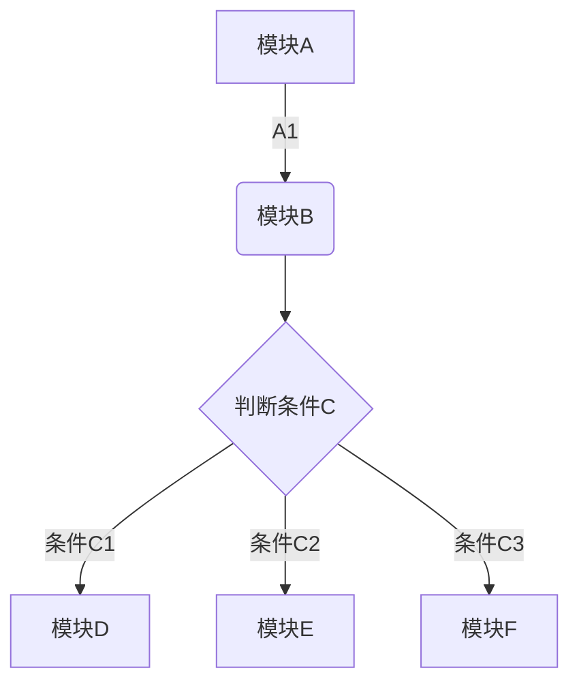
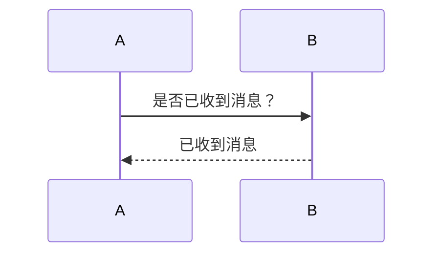

## 怎样使用markdown 

正文直接书写即可，如果需要换行的话就直接空一行，看看效果是不是这样

<center>测试一下</center>

```python
print("hello,jack")
print("hello world")
```
`
this is the code just line 1
`

<center>正文中的代码，直接通过``print out``直接框出来</center>

有序列表

1. 这是第一行数据
2. 这是第二行数据
3. 这是第三行数据
   1. 这是一个行缩进的数据
   2. 这是第二行缩进的数据

无序列表

- 这是无序列表第一行数据
- 这是无序列表第二行数据``test a code line1 ``
  - 这是分列1
  - 这是分列2
    - `` this is code3 ``
- 
*斜体*

**加粗字体**

***斜体加粗***

~~这是要删除的文字~~

>这是要引用的内容

>>这是要引用的内容

三个以上的*或者三个以上的---就是分割线
***
----


[参考文章 MARKDOWN语法](https://www.jianshu.com/p/191d1e21f7ed/)

表格

姓名|年龄|班级
--:|:--:|:--
23|37|三
陶叶456|33|二班

流程图





[把markdown转换成HTML的工具](https://baijiahao.baidu.com/s?id=1617649217992125354&wfr=spider&for=pc)